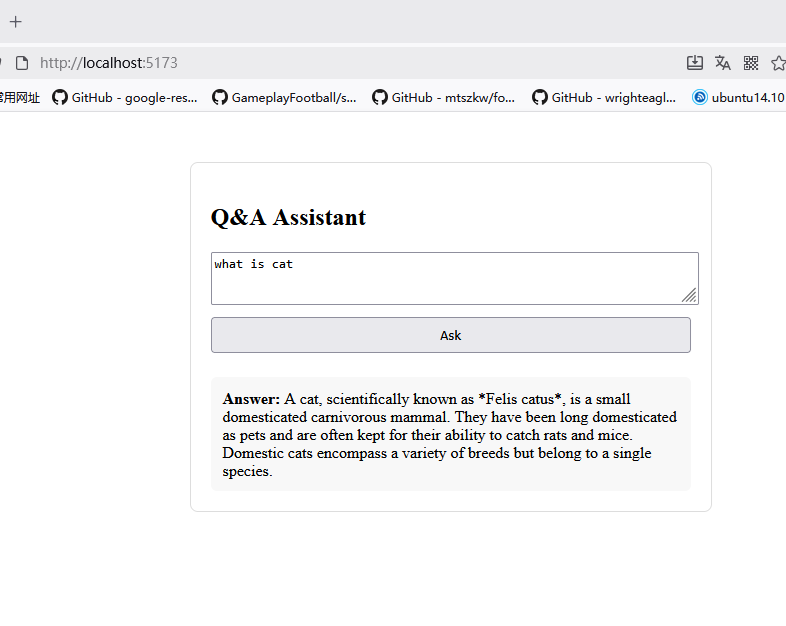

# LangGraph Adaptive RAG


**LangGraph Adaptive RAG** is an end-to-end Retrieval-Augmented Generation (RAG) application that leverages [LangChain](https://www.langchain.com/), [LangGraph](https://github.com/langchain-ai/langgraph), and modern LLM inference APIs to provide adaptive question answering via both vectorstore retrieval and up-to-date web search.

- **Frontend**: A simple React SPA for users to ask questions and view answers.
- **Backend**: A FastAPI service orchestrating LLMs, document retrieval, web search, and automatic answer grading using the LangGraph state machine architecture.

---

## Features

- **Hybrid Retrieval**: Automatically select between vectorstore and web search based on the question.
- **RAG Pipeline**: Retrieve, rerank, generate, and grade answers in a robust workflow.
- **Hallucination and Relevance Detection**: Graders check hallucination, fact grounding, and whether the answer resolves the question.
- **Prompt Rewriting**: Iteratively improve queries for better retrieval.
- **Configurable Embeddings/Vectorstore**: Easy to add or update indexed documents.
- **API Key Management**: Environment variable-based credential loading.
- **Easy frontend integration**: Out-of-the-box web interface.

---

## Project Structure

```
.
├── App.jsx                 # Main React component (frontend)
├── main.jsx                # React SPA entry point
├── main.py                 # FastAPI entry point (backend)
├── compilegraph.py         # Builds LangGraph state machine for RAG workflow
├── graphflow.py            # RAG logic: retrieval, grading, etc.
├── index.py                # Vectorstore setup and retrieval
├── search.py               # Web search utility
├── answer_grader.py        # Grades answer relevance
├── hallucination_grader.py # Grades hallucination
├── question_rewriter.py    # Rewrites/optimizes queries
├── route.py                # Data source routing logic (vectorstore vs web)
├── ...
```

---

## Quick Start

### 1. Clone This Repository

```bash
git clone https://github.com/dl956/Langgraph_Adaptive_Rag.git
cd Langgraph_Adaptive_Rag
```

### 2. Install Python Dependencies

It is strongly recommended to use a virtualenv:

```bash
python3 -m venv venv
source venv/bin/activate
pip install -r requirements.txt
```

### 3. Configure Environment Variables

Create a `.env` file in the project root with your keys:

```
OPENAI_API_KEY=your_openai_api_key_here
TAVILY_API_KEY=your_tavily_api_key_here
USER_AGENT=HierarchicalAgentTeams/1.0
```
> **Never commit your real API keys to version control.**

### 4. Start the Backend

```bash
python main.py
```
Backend will start listening (default port: 3001).

### 5. Start the Frontend

Install Node dependencies and launch the dev server:

```bash
npm install
npm run dev
```
This will start the React app (default: [http://localhost:5173](http://localhost:5173)).

---

## Usage

- Open the web interface in your browser.
- Ask any question about agents, prompt engineering, LLMs, or other topics.
- The system will automatically fetch answers from the vectorstore or search the web as appropriate, and display the answer with auto-grading/validation.

---

## Extending

- To add or update the domain documents, modify the `urls` list in `index.py` and restart the backend to refresh the vectorstore.
- For custom retrieval logic, edit `graphflow.py` and `route.py`.

---

## Notes

- Requires valid OpenAI and Tavily API keys for full functionality.
- Designed as a research/engineering demonstration of adaptive RAG, grading and multi-source search powered by stateful graphs.
- For production use, apply further security, error handling, and API restrictions as needed.

---

## License

MIT License.

---

## Acknowledgements

- [LangChain](https://github.com/langchain-ai/langchain)
- [LangGraph](https://github.com/langchain-ai/langgraph)
- [OpenAI](https://platform.openai.com/)
- [Tavily Search](https://www.tavily.com/)
